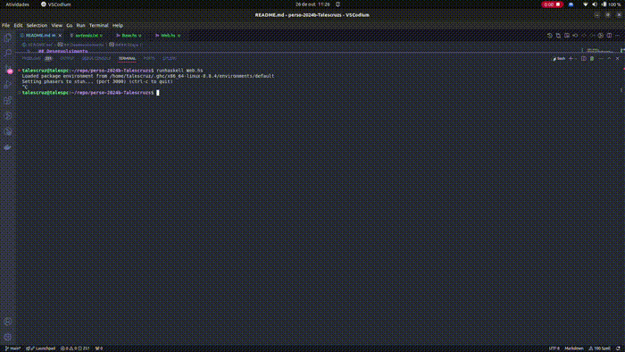

## Tales Cruz - Sistemas de Informação

## Proposta:
Criar um jogo similar ao [Termo](<https://term.ooo/>). 

De forma resumida, o jogo consiste em um jogador possuir 5 tentativas de chute para acertar uma palavra sorteada.

## Desenvolvimento
Para desenvolver este programa utilizei o Codespace disponibilizado no inicio do semestre, pois já estva com o haskell rodando corretamente. Desta forma o progresse na construção do código ficou no outro repositório.

Passos para a execução na minha máquina (antes sem haskell - Ubuntu 22.04):
    1 - sudo apt install ghc
    2 - sudo apt install cabal-install (cabal update caso já possua o cabal)
    3 - cabal install --lib random scotty
    4 - cabal init
    5 - cabal build
    6 - runhaskell Web.hs

#### Etapa 1:
A primeira parte do desenvvolvimento envolvia utilizar o GHCI para verificar se duas palavras eram iguais, detalhadamente (letra por letra). Esta etapa foi realizada rapidamente com estas funções:
``` hs
verificaInt :: Int -> Bool
verificaInt i = if(i == 1) then False else True

letraPalavra :: Char -> String -> Int -> Int -> Int
letraPalavra letra palavra pos posChute
    | length palavra <= pos = 0
    | (palavra !! pos) == letra && pos == posChute = 2
    | elem letra palavra = 1
    | otherwise = 0

comparaPalavra :: String -> String -> [Int]
comparaPalavra pChute pReal = zipWith (\pos c1 -> letraPalavra c1 pReal pos pos) [0..] pChute

verificaVitoria :: [Int] -> Bool
verificaVitoria l = if(length(filter verificaInt l) == 0) then True else False
```

#### Etapa 2:
Posteriormente quis começar a parte do sorteio das palavras, juntamente com uma parte visual básica. Então precisei de funções que manipulavam arquivos. Nunca havia utilizado elas.
``` hs
inserirPalavra :: FilePath -> String -> IO ()
inserirPalavra filePath palavra = do
    appendFile filePath (palavra ++ "\n")

escreverPalavra :: FilePath -> String -> IO ()
escreverPalavra filePath palavra = do
    writeFile filePath (palavra ++ "\n")

lerPalavra :: FilePath -> IO T.Text
lerPalavra filePath = do
    handle <- openFile filePath ReadMode 
    conteudo <- TIOStrict.hGetContents handle  
    hClose handle  
    let palavras = T.words (T.fromStrict conteudo)  
    return $ if null palavras                       
             then T.empty                           
             else case listToMaybe palavras of
                    Just p  -> p
                    Nothing -> T.empty                  

lerPalavras :: FilePath -> IO [T.Text]
lerPalavras filePath = do
    handle <- openFile filePath ReadMode  
    conteudo <- TIOStrict.hGetContents handle  
    hClose handle  
    let palavras = T.words (T.fromStrict conteudo)  
    return $ if null palavras                       
             then [T.empty]                         
             else palavras    
```
As rotas estavam assim:
```hs
get "/" $ do
    palavra <- liftIO $ fetchRandomWord "palavras.txt"  -- Chama a função e obtém o nome
    let palavraString = T.unpack palavra
    -- Insere a palavra no arquivo "sorteada.txt"
    liftIO $ escreverPalavra "sorteada.txt" palavraString

    htmlContent <- liftIO $ TIO.readFile "static/index.html" -- Carrega o HTML
    let htmlWithUser = T.replace "{{palavra}}" palavra htmlContent -- Substitui o placeholder
    html htmlWithUser

post "/chute" $ do
    palavra <- param "palavra"
    let palavraString = T.unpack palavra
    -- Insere a palavra no arquivo "sorteada.txt"
    liftIO $ inserirPalavra "chutes.txt" palavraString
```

Tambem nesta etapa já tinha um html que mostrava a palavra e permitia chutar a palavra
```html 
<body>
    <p>palavra: {{palavra}}</p>
    <form action="/chute" method="POST">
        <label for="word">Digite um chute de palavra 5 letras:</label>
        <input type="text" id="palavra" name="palavra" maxlength="5" minlength="5" required>
        <input type="submit" value="Chutar">
    </form>
</body>
```

#### Etapa 3:
Neste momento o esqueleto principal do código estava feito, precisava apenas armazenar os chutes do usuário, construir a comparação da palavra sorteada com cada chute e construir o html com base nestas comparações, bem como verificar se o jogador acertou a palavra ou passou o limite de tentativas, redirecionando-o para uma rota de vitória ou derrota.

Rotas:
``` hs
get "/" $ do
    palavra <- liftIO $ lerPalavras "data/sorteada.txt"
    let palavraString = case listToMaybe palavra of
        Just p  -> T.unpack p
        Nothing -> "" 

    if palavraString == "" then do
        sorteada <- liftIO $ fetchRandomWord "data/palavras.txt"  -- Chama a função e obtém o nome
        let sorteadaString = T.unpack sorteada
        liftIO $ escreverPalavra "data/sorteada.txt" sorteadaString
        
        redirect "/"
        
    else do
        atual <- liftIO $ lerPalavra "data/sorteada.txt" 
        chutes <- liftIO $ lerPalavras "data/chutes.txt"

        let atualString = T.unpack atual
        let chutesString = map T.unpack chutes

        let comparacoes = map (\x -> comparaPalavra x atualString) chutesString
        let final = map (\(comp, chute) -> zip chute comp) (zip comparacoes chutesString)

        htmlContent <- liftIO $ TIO.readFile "static/index.html" 
        let jogoHtml = renderJogoHtml final

        let htmlWithUser = T.replace "{{jogo}}" (jogoHtml) htmlContent
        html htmlWithUser

post "/chute" $ do
    palavra <- param "palavra"
    palavraSorteada <- liftIO $ lerPalavra "data/sorteada.txt"

    let palavraString = T.unpack palavra        
    let palavraSorteadaString = T.unpack palavraSorteada

    liftIO $ inserirPalavra "data/chutes.txt" palavraString
    chutes <- liftIO $ lerPalavras "data/chutes.txt"

    if palavraString == palavraSorteadaString then do
        liftIO $ escreverPalavra "data/sorteada.txt" ""
        liftIO $ escreverPalavra "data/chutes.txt" ""
        redirect "/venceu"

    else if((length chutes) >= 5) then do
        liftIO $ escreverPalavra "data/sorteada.txt" ""
        liftIO $ escreverPalavra "data/chutes.txt" ""
        redirect "/perdeu"

    else do
        redirect "/"

get "/venceu" $ do
    htmlContent <- liftIO $ TIO.readFile "static/vitoria.html"
    html htmlContent

get "/perdeu" $ do
    htmlContent <- liftIO $ TIO.readFile "static/derrota.html"
    html htmlContent
```

Construção do HTML para o estado atual do jogo
``` hs
renderJogoHtml :: [[(Char, Int)]] -> T.Text
renderJogoHtml jogo = T.concat [
    "<div class=\"jogo\">",
    T.concat [renderLinha linha | linha <- jogo],
    "</div>"
    ]

renderLinha :: [(Char, Int)] -> T.Text
renderLinha linha = 
    "<div class=\"palavra\">" <> T.concat [renderCelula (letra, cor) | (letra, cor) <- linha] <> "</div>"

renderCelula :: (Char, Int) -> T.Text
renderCelula (letra, cor) =
    let corClasse = case cor of
                      0 -> "gray"
                      1 -> "yellow"
                      2 -> "green"
    in "<div class=\"letter-box " <> T.pack corClasse <> "\">" <> T.pack [letra] <> "</div>"
```

Sorteio da palavra na lista de palavras:
``` hs
fetchRandomWord :: FilePath -> IO T.Text
fetchRandomWord filePath = do
    contents <- TIO.readFile filePath
    let words = T.lines contents
    if null words
        then return "Nenhuma palavra disponível."
        else do
            index <- randomRIO (0, length words - 1)
            return (words !! index)

-- Função que sorteia uma palavra e a escreve em um arquivo
sorteiaPalavra :: ActionM ()
sorteiaPalavra = do
    palavra <- liftIO $ fetchRandomWord "data/palavras.txt"  
    let palavraString = T.unpack palavra 

    liftIO $ escreverPalavra "data/sorteada.txt" palavraString
```
#### Problemas Encontrados
Durante o desenvolvimento foram encotnrados muitos problemas de escrita ou leitura de arquivos que estavam abertos, isto até começar a utilizar o `hClose`. Também foi relativamente sofrido criar o html dinamicamente dentro de funções. 

Um desafio relacionado à linguagem foi a tipagem das "saídas" das funções que interagem com arquivos, o IO() ou então ActionM(), que causaram confusão no desenvolvimento.

## Resultado final


## Referencias:
[Meu chat GPT](<https://chatgpt.com/share/671cf111-2ed4-800a-9b98-f4679b67ff89>) 

[Documentação do Scotty](<https://hackage.haskell.org/package/scotty>)

[Jogo Termo de inspiração](<https://term.ooo/>)